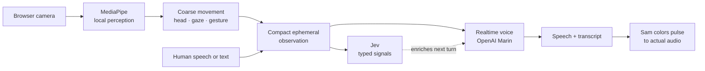

# How Sam works

Sam keeps perception local and makes every handoff small enough to inspect. The browser turns a live camera session into coarse, ephemeral observations; Jev adds typed attention signals; the voice model keeps the conversation moving.



## The boundary

Raw frames and landmarks stay in the browser. Jev receives bounded text and compact structured observations; the voice provider additionally receives microphone audio during voice sessions. A room description, when supplied, is human-provided context—not something Sam claims to sense.

The following is illustrative schema, not an API contract:

```json
{
  "utterance": "What should I look at next?",
  "target": { "label": "blue card", "dwellMs": 860 },
  "neighbors": ["red card", "notebook"],
  "observation": {
    "gaze": { "x": 0.62, "y": 0.41 },
    "head": { "yaw": -0.08, "pitch": 0.03 },
    "movement": "steady",
    "gesture": "pointing"
  }
}
```

Jev's response is likewise typed and bounded: relevance, grounding, perspective, and confidence-like signals that can shape pacing and the next voice context. It is an attention signal, not a diagnosis, permission, or command.

## Timing that stays responsive

Local perception can update several times per second without a network round trip. The public relay coalesces those updates into the latest observation and paces provider context updates. Jev runs alongside the conversation and may finish after a voice turn has already started; Sam responds using the context available for that turn. Voice activity detection identifies speech boundaries, while the app schedules responses and discards stale work when a new speech epoch begins. Hold-to-talk commits audio when the user releases.

OpenAI Marin is the primary voice. Grok Carina takes over when OpenAI explicitly reports exhausted credit or when the demo's OpenAI reservation allowance is unavailable. Transient rate limits do not change providers. The server keeps separate provider ledgers and keys, bounds sessions and usage, and preserves the original session end time across fallback.

The Sam mark's color motion is driven by measured assistant audio playback. It does not infer a person's mood from pixels.

## Privacy in one sentence

Pixels and landmarks remain on-device; only permissioned voice and compact, ephemeral observations cross the provider boundary.

This public showcase contains the static page, demo media, and this technical walkthrough. The implementation remains private.
